# 📊 Device Lifecycle Management (DLM) Analysis Suite

A comprehensive Python-based tool for analyzing IT inventory data, performing advanced data cleaning, and conducting device lifecycle risk assessments to support strategic technology replacement planning.

## 🎯 **Project Overview**

This suite provides end-to-end device lifecycle management analysis, from raw inventory data cleaning to sophisticated risk-based replacement planning. It handles real-world data quality issues and provides actionable insights for IT management decisions.

## 🔄 **Complete Process Flow (Visual)**

```mermaid
flowchart TD
    A["📁 Raw Inventory CSV"] --> B["🔄 Data Import & Validation"]
    B --> C{"📋 Status Check"} & G{"🏷️ Brand Validation"} & J{"📂 Category Validation"} & M{"📅 Date Validation"}
    C -- Active --> D["✅ Available/Active Devices"]
    C -- Inactive --> E["❌ Unavailable/Inactive Devices"]
    C -- Unknown --> F["❓ Unknown Status Devices"]
    G -- Recognized --> H["✅ Recognized Brands"]
    G -- Unrecognized --> I["❌ Unrecognized Brands"]
    J -- Valid --> K["✅ Recognized Categories"]
    J -- Invalid --> L["❌ Unrecognized Categories"]
    M -- Valid --> N["✅ Valid Purchase Dates"]
    M -- Invalid --> O["❌ Invalid Purchase Dates"]
    I --> P["🔧 Advanced Data Recovery"]
    L --> P
    P --> Q{"📝 Description Analysis"}
    Q -- Found --> R["✅ Brand/Category Recovered"]
    Q -- Not Found --> S["🔍 Model Field Analysis"]
    S -- Found --> R
    S -- Not Found --> T["❌ Remains Invalid"]
    H --> U["📊 Enhanced Dataset Assembly"]
    K --> U
    N --> U
    D --> U
    R --> U
    U --> V["📈 Enhanced Fully Valid Data"]
    V --> W{"🎯 Active Status Filter"}
    W -- "Active Only" --> X["🎯 Analysis Ready Data"]
    W -- "All Devices" --> Y["📋 Complete Enhanced Dataset"]
    X --> Z["⚖️ Multi-Factor Risk Scoring"]
    Z --> AA["🕐 Age Risk Calculation"] & BB["🏷️ Brand Risk Assessment"] & CC["📂 Category Risk Evaluation"]
    AA --> DD["📊 Total Risk Score"]
    BB --> DD
    CC --> DD
    DD --> EE{"🚨 Risk Classification"}
    EE -- "70+ Points" --> FF["🔴 HIGH RISK<br/>Replace in 6 months"]
    EE -- "35-69 Points" --> GG["🟡 MEDIUM RISK<br/>Replace in 6-18 months"]
    EE -- "<35 Points" --> HH["🟢 LOW RISK<br/>Replace in 18+ months"]
    FF --> II["📋 Priority Ranking<br/>Within Risk Level"]
    GG --> II
    HH --> II
    II --> JJ["📊 Executive Dashboard"] & KK["📈 Brand Risk Analysis"] & LL["📂 Category Risk Analysis"] & MM["📅 Age Distribution Analysis"]
    JJ --> NN["📄 Risk Summary Report"]
    KK --> OO["📄 Replacement Planning"]
    LL --> PP["📄 Budget Prioritization"]
    MM --> QQ["📄 Strategic Planning"]
    E --> RR["🗂️ Inactive Device Archive"]
    F --> SS["🔍 Manual Status Review"]
    T --> TT["🔧 Manual Correction Queue"]
    O --> UU["📅 Date Correction Queue"]
    
    style A fill:#E3F2FD,stroke:#1976D2,stroke-width:2px
    style P fill:#FFF9C4,stroke:#F57F17,stroke-width:2px
    style V fill:#C8E6C9,stroke:#4CAF50,stroke-width:2px
    style X fill:#C8E6C9,stroke:#388E3C,stroke-width:2px
    style Z fill:#E8EAF6,stroke:#3F51B5,stroke-width:2px
    style FF fill:#FFCDD2,stroke:#D32F2F,stroke-width:2px
    style GG fill:#FFF3E0,stroke:#F57C00,stroke-width:2px
    style HH fill:#E8F5E8,stroke:#4CAF50,stroke-width:2px
    style NN fill:#F3E5F5,stroke:#7B1FA2,stroke-width:2px
```

