# Device Lifecycle Management (DLM) Workflow Visualization

## Overview Flowchart

```mermaid
flowchart TD
    A[📄 CSV Inventory File] --> B[🔍 Data Analysis Engine]
    
    B --> C{Data Validation & Cleaning}
    
    C --> D[🏷️ Brand Normalization]
    C --> E[📂 Category Normalization]
    C --> F[📅 Purchase Date Validation]
    
    D --> D1[✅ Recognized Brands]
    D --> D2[❌ Unrecognized Brands]
    
    E --> E1[✅ Recognized Categories]
    E --> E2[❌ Unrecognized Categories]
    
    F --> F1[✅ Valid Purchase Dates]
    F --> F2[❌ Invalid Purchase Dates]
    
    D1 --> G[📊 Data Quality Analysis]
    D2 --> G
    E1 --> G
    E2 --> G
    F1 --> G
    F2 --> G
    
    G --> H[📋 Multi-Sheet Excel Report<br/>10 categorized data sheets<br/>+ Quality summary dashboard]
    
    H --> I[🎯 Fully Valid Data]
    I --> J[⚡ Risk Analysis Engine]
    
    J --> K[📈 Risk Scoring]
    K --> L[🔴 High Risk Devices]
    K --> M[🟡 Medium Risk Devices]
    K --> N[🟢 Low Risk Devices]
    
    L --> O[📊 Executive Dashboard]
    M --> O
    N --> O
    
    style A fill:#4A90E2,color:#ffffff
    style B fill:#e3f2fd
    style C fill:#F39C12,color:#ffffff
    style D fill:#fff3e0
    style E fill:#fff3e0
    style F fill:#fff3e0
    style D1 fill:#fff3e0
    style D2 fill:#fff3e0
    style E1 fill:#fff3e0
    style E2 fill:#fff3e0
    style F1 fill:#fff3e0
    style F2 fill:#fff3e0
    style G fill:#fff3e0
    style H fill:#fff3e0
    style I fill:#fff3e0
    style J fill:#E74C3C,color:#ffffff
    style K fill:#ffebee
    style L fill:#ffebee
    style M fill:#ffebee
    style N fill:#ffebee
    style O fill:#ffebee
```

## How to View This Diagram

1. **Press `Ctrl+Shift+V`** to open Markdown Preview
2. **Or right-click** → "Open Preview"
3. **Your diagram will render automatically!**