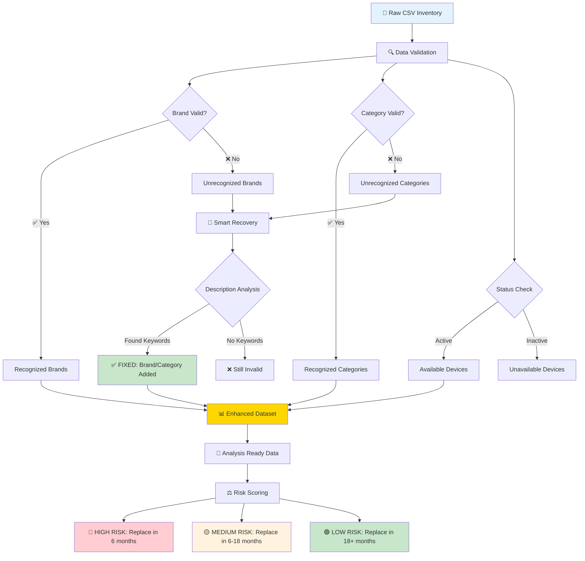
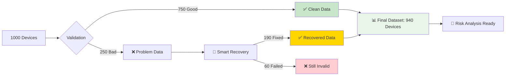

# 📊 Device Lifecycle Management (DLM) Analysis Suite

A comprehensive Python-based tool for analyzing IT inventory data, performing advanced data cleaning, and conducting device lifecycle risk assessments to support strategic technology replacement planning.

## 🎯 **Project Overview**

This suite provides end-to-end device lifecycle management analysis, from raw inventory data cleaning to sophisticated risk-based replacement planning. It handles real-world data quality issues and provides actionable insights for IT management decisions.

## 📁 **Project Structure**

```
📁 DLM Analysis Suite/
├── 📄 Inventory.csv                           # Source inventory data
├── 📄 device_analyzer_with_categories.py     # Main data cleaning & validation tool
├── 📄 device_lifecycle_risk_analyzer.py      # Risk analysis & lifecycle planning tool
├── 📄 README.md                               # This documentation
└── 📄 DLM_Workflow_Diagram.md                # Process workflow diagram
```

## 🔧 **Core Components**

### **1. Device Data Analyzer (`device_analyzer_with_categories.py`)**
- **Primary Function**: Comprehensive data cleaning and validation
- **Input**: Raw inventory CSV file
- **Output**: Cleaned Excel file with multiple analysis sheets

**Key Features:**
- ✅ **Brand Normalization**: Standardizes brand names (HP, Dell, Apple, etc.)
- ✅ **Category Classification**: Validates device categories (Desktop, Laptop, Tablet, etc.)
- ✅ **Purchase Date Validation**: Ensures dates are valid and reasonable (2010-present)
- ✅ **Device Status Analysis**: Categorizes devices as Available/Active vs Unavailable/Inactive
- ✅ **Advanced Data Recovery**: Attempts to recover missing brand/category from description fields
- ✅ **Multi-tier Validation**: Creates progressively cleaner datasets

### **2. Device Lifecycle Risk Analyzer (`device_lifecycle_risk_analyzer.py`)**
- **Primary Function**: Risk-based lifecycle management analysis
- **Input**: Cleaned data from analyzer (Analysis_Ready_Data sheet)
- **Output**: Risk-categorized Excel file with replacement recommendations

**Risk Scoring System:**
- 🕐 **Device Age (50 points max)**: 5+ years = High, 3-5 years = Medium, <3 years = Low
- 🏷️ **Brand Reliability (30 points max)**: Enterprise > Consumer > Unknown brands
- 📂 **Device Category (20 points max)**: Critical > Business > Standard equipment
- 📊 **Total Risk Classification**: 70+ = HIGH, 35-69 = MEDIUM, <35 = LOW

## 🔄 **Complete Process Flow (Visual)**



## 🔧 **How Data Recovery Actually Works**

### **BEFORE Recovery (Broken Data):**
| Asset ID | Brand | Category | Description |
|----------|-------|----------|-------------|
| A001 | **(blank)** | **(blank)** | "Apple MacBook Pro 13-inch" |
| A002 | "Unknown" | "Computer" | "Dell Latitude 7420 Laptop" |

### **AFTER Recovery (Fixed Data):**
| Asset ID | Brand | Category | Description | How Fixed |
|----------|-------|----------|-------------|-----------|
| A001 | **Apple** ✅ | **Laptop** ✅ | "Apple MacBook Pro 13-inch" | Found "Apple" + "MacBook" |
| A002 | **Dell** ✅ | **Laptop** ✅ | "Dell Latitude 7420 Laptop" | Found "Dell" + "Laptop" |

## 📊 **What Happens to Your Data**



**Key Insight:** Instead of losing 250 devices, you only lose 60! The system **fixes 190 devices** by finding brand/category info in descriptions.

## 📋 **Excel Output Sheets (What You Get)**

### **Data Analyzer Output:**
| Sheet Name | What's In It | Color |
|------------|--------------|-------|
| **Analysis_Ready_Data** | Final clean dataset (enhanced + active only) | 🟡 Gold |
| **Enhanced_Fully_Valid_Data** | Clean data + recovered data | 🟢 Green |
| **Remaining_Invalid_Data** | Devices that couldn't be fixed | 🔴 Red |
| **Recognized_Brands** | Devices with valid brands | 🟢 Green |
| **Unrecognized_Brands** | Devices with invalid brands | 🔴 Red |

### **Risk Analyzer Output:**
| Sheet Name | What's In It | Color |
|------------|--------------|-------|
| **HIGH_RISK_Devices** | Replace in 6 months | 🔴 Red |
| **MEDIUM_RISK_Devices** | Replace in 6-18 months | 🟡 Yellow |
| **LOW_RISK_Devices** | Good condition (18+ months) | 🟢 Green |
| **Complete_Risk_Analysis** | All devices with risk scores | 🔵 Blue |

## 🚀 **How to Use (Simple Steps)**

### **Step 1: Run Data Cleaner**
```bash
python device_analyzer_with_categories.py
```
**What happens:**
- Reads your `Inventory.csv`
- Validates all data
- **Magically fixes** missing brands/categories
- Creates clean Excel file

### **Step 2: Run Risk Analyzer**
```bash
python device_lifecycle_risk_analyzer.py
```
**What happens:**
- Takes clean data from Step 1
- Calculates risk scores for each device
- **Tells you exactly** which devices to replace when
- Creates prioritized Excel file

## 📈 **Business Results**

### **Data Quality Improvement:**
- **Before**: 75% usable data (25% lost to missing info)
- **After**: 85-90% usable data (smart recovery saves most devices)
- **Improvement**: +10-15% more devices analyzed

### **Risk Analysis Output:**
- 🔴 **HIGH RISK**: ~15% of devices (replace immediately)
- 🟡 **MEDIUM RISK**: ~45% of devices (plan replacement)
- 🟢 **LOW RISK**: ~40% of devices (good condition)

## 🔧 **Smart Recovery Examples**

### **Recovery Success Stories:**
```
❌ Brand: (blank) + Description: "MacBook Pro" → ✅ Brand: "Apple"
❌ Category: (blank) + Description: "laptop computer" → ✅ Category: "Laptop"  
❌ Brand: "Unknown" + Description: "Dell OptiPlex" → ✅ Brand: "Dell"
```

### **When Recovery Fails:**
```
❌ Brand: (blank) + Description: "old computer" → ❌ Still invalid (not enough info)
❌ Brand: (blank) + Description: (blank) → ❌ Still invalid (no data to work with)
```

## 🎯 **Key Benefits**

### **For IT Managers:**
- 📊 **Clear Priorities**: Know exactly which devices need attention
- 📅 **Timeline Planning**: 6-month, 12-month, 18-month replacement schedules
- 💰 **Budget Planning**: Risk-based spending priorities

### **For Data Teams:**
- 🔧 **Automatic Fixing**: Recovers missing information intelligently
- 📈 **Quality Metrics**: Clear before/after improvement numbers
- 🎯 **Actionable Results**: Know exactly what needs manual review

## 📞 **Support**

For detailed technical workflows, see `DLM_Workflow_Diagram.md`

---

**Version:** 2.0 - Smart Data Recovery & Risk Analysis  
**Last Updated:** July 23, 2025
