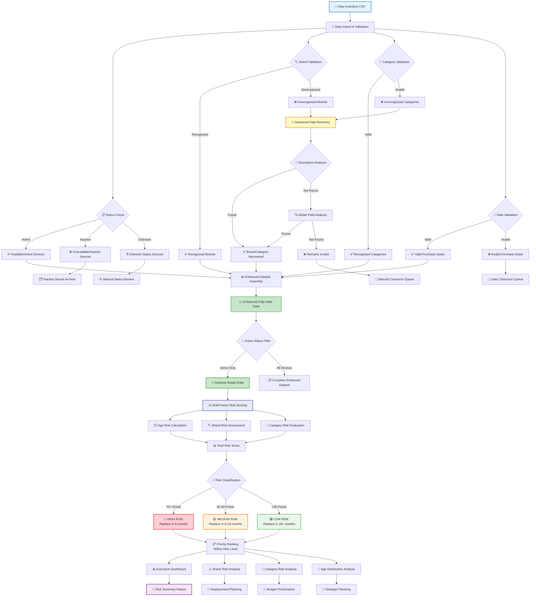
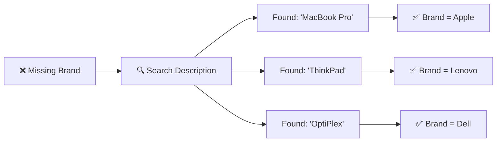

# 📊 Device Lifecycle Management (DLM) Analysis Suite

A comprehensive Python-based tool for analyzing IT inventory data, performing advanced data cleaning, and conducting device lifecycle risk assessments to support strategic technology replacement planning.

## 🎯 **Project Overview**

This suite provides end-to-end device lifecycle management analysis, from raw inventory data cleaning to sophisticated risk-based replacement planning. It handles real-world data quality issues and provides actionable insights for IT management decisions.

## 📁 **Project Structure**

```
📁 DLM Analysis Suite/
├── 📄 Inventory.csv                           # Source inventory data
├── 📄 device_analyzer_with_categories.py     # Main data cleaning & validation tool
├── 📄 device_lifecycle_risk_analyzer.py      # Risk analysis & lifecycle planning tool
├── 📄 README.md                               # This documentation
└── 📄 DLM_Workflow_Diagram.md                # Process workflow diagram
```

## 🔧 **Core Components**

### **1. Device Data Analyzer (`device_analyzer_with_categories.py`)**
- **Primary Function**: Comprehensive data cleaning and validation
- **Input**: Raw inventory CSV file
- **Output**: Cleaned Excel file with multiple analysis sheets

**Key Features:**
- ✅ **Brand Normalization**: Standardizes brand names (HP, Dell, Apple, etc.)
- ✅ **Category Classification**: Validates device categories (Desktop, Laptop, Tablet, etc.)
- ✅ **Purchase Date Validation**: Ensures dates are valid and reasonable (2010-present)
- ✅ **Device Status Analysis**: Categorizes devices as Available/Active vs Unavailable/Inactive
- ✅ **Advanced Data Recovery**: Attempts to recover missing brand/category from description fields
- ✅ **Multi-tier Validation**: Creates progressively cleaner datasets

### **2. Device Lifecycle Risk Analyzer (`device_lifecycle_risk_analyzer.py`)**
- **Primary Function**: Risk-based lifecycle management analysis
- **Input**: Cleaned data from analyzer (Analysis_Ready_Data sheet)
- **Output**: Risk-categorized Excel file with replacement recommendations

**Risk Scoring System:**
- 🕐 **Device Age (50 points max)**: 5+ years = High, 3-5 years = Medium, <3 years = Low
- 🏷️ **Brand Reliability (30 points max)**: Enterprise > Consumer > Unknown brands
- 📂 **Device Category (20 points max)**: Critical > Business > Standard equipment
- 📊 **Total Risk Classification**: 70+ = HIGH, 35-69 = MEDIUM, <35 = LOW

## 🔄 **Complete Process Flow (Visual)**



## 🔧 **How Data Recovery Actually Works**

### **Phase 1: Multi-Dimensional Validation**
The system simultaneously validates four key aspects of your data:

**📋 Status Validation**: Active vs Inactive devices
**🏷️ Brand Validation**: Recognized vs Unrecognized brands  
**📂 Category Validation**: Valid vs Invalid categories
**📅 Date Validation**: Valid vs Invalid purchase dates

### **Phase 2: Smart Data Recovery**
When devices have missing/invalid brand or category information, the system doesn't give up - it tries to recover the missing data:

#### **Step 1: Description Analysis**


#### **Step 2: Model Field Analysis** 
If description analysis fails, the system checks the Model field for clues.

#### **Recovery Results:**
- **✅ Brand/Category Recovered**: Device gets fixed and moves to clean data
- **❌ Remains Invalid**: Device goes to manual correction queue

### **BEFORE Recovery (Broken Data):**
| Asset ID | Brand | Category | Description |
|----------|-------|----------|-------------|
| A001 | **(blank)** | **(blank)** | "Apple MacBook Pro 13-inch" |
| A002 | "Unknown" | "Computer" | "Dell Latitude 7420 Laptop" |

### **AFTER Recovery (Fixed Data):**
| Asset ID | Brand | Category | Description | How Fixed |
|----------|-------|----------|-------------|-----------|
| A001 | **Apple** ✅ | **Laptop** ✅ | "Apple MacBook Pro 13-inch" | Found "Apple" + "MacBook" |
| A002 | **Dell** ✅ | **Laptop** ✅ | "Dell Latitude 7420 Laptop" | Found "Dell" + "Laptop" |

## 📊 **Data Flow & Enhancement Process**

### **Enhanced Dataset Assembly**
The system combines all valid data sources:
- ✅ Originally recognized brands
- ✅ Originally valid categories  
- ✅ Valid purchase dates
- ✅ Available/active devices
- ✅ **Newly recovered devices** (the magic!)

This creates the **Enhanced Fully Valid Data** - a significantly improved dataset.

### **Analysis Ready Data Creation**
From the enhanced dataset, the system filters to include only **active devices** for lifecycle analysis, creating the **Analysis Ready Data** that feeds into risk assessment.

## ⚖️ **Risk Scoring & Classification**

### **Multi-Factor Risk Assessment**
Each device gets scored across three dimensions:

**🕐 Age Risk (50 points max)**
- 5+ years: High risk (35-50 points)
- 3-5 years: Medium risk (15-35 points)  
- 0-3 years: Low risk (0-15 points)

**🏷️ Brand Risk (30 points max)**
- Enterprise brands (HP, Dell, Apple): Low risk (5 points)
- Consumer brands (Acer, ASUS): Medium risk (15 points)
- Unknown brands: High risk (30 points)

**📂 Category Risk (20 points max)**
- Critical equipment (Server, Network): High risk (20 points)
- Business equipment (Desktop, Laptop): Medium risk (10 points)
- Standard equipment (Tablet, Accessories): Low risk (3 points)

### **Risk Classification**
**🔴 HIGH RISK (70+ points)**: Replace within 6 months
**🟡 MEDIUM RISK (35-69 points)**: Replace within 6-18 months  
**🟢 LOW RISK (<35 points)**: Replace in 18+ months

## 📊 **Business Intelligence & Reporting**

The system generates comprehensive reports across multiple dimensions:

**📊 Executive Dashboard**: Overall risk summary and key metrics
**📈 Brand Risk Analysis**: Performance analysis by manufacturer
**📂 Category Risk Analysis**: Risk breakdown by equipment type  
**📅 Age Distribution Analysis**: Device age patterns and trends

Each analysis feeds into specific business planning outputs:
- **📄 Risk Summary Report**: Executive decision making
- **📄 Replacement Planning**: IT procurement scheduling
- **📄 Budget Prioritization**: Financial planning support
- **📄 Strategic Planning**: Long-term technology roadmap

## 📋 **Excel Output Structure**

### **Data Analyzer Output (`device_analysis_with_categories.xlsx`)**
| Sheet Name | Purpose | Color | Typical Count |
|------------|---------|-------|---------------|
| **Analysis_Ready_Data** | Final clean dataset (active devices only) | 🟡 Gold | ~65-75% |
| **Enhanced_Fully_Valid_Data** | All clean data (including recovered) | 🟢 Bright Green | ~80-90% |
| **Recognized_Brands** | Devices with valid brands | 🟢 Green | ~85-95% |
| **Unrecognized_Brands** | Devices with invalid brands | 🔴 Red | ~5-15% |
| **Recognized_Categories** | Devices with valid categories | 🟢 Green | ~90-98% |
| **Unrecognized_Categories** | Devices with invalid categories | 🔴 Red | ~2-10% |
| **Available_Active_Devices** | Devices available for use | 🟢 Green | ~70-80% |
| **Unavailable_Inactive_Devices** | Disposed/broken/donated devices | 🔴 Red | ~15-25% |

### **Risk Analyzer Output (`device_lifecycle_risk_analysis.xlsx`)**
| Sheet Name | Purpose | Color | Typical % |
|------------|---------|-------|-----------|
| **Complete_Risk_Analysis** | Full risk analysis with scores | 🔵 Blue | 100% |
| **HIGH_RISK_Devices** | Immediate replacement needed | 🔴 Red | ~10-15% |
| **MEDIUM_RISK_Devices** | Planned replacement | 🟡 Yellow | ~40-50% |
| **LOW_RISK_Devices** | Good condition | 🟢 Green | ~35-45% |
| **Risk_Summary_Dashboard** | Executive summary | 🟣 Purple | Summary |
| **Brand_Risk_Analysis** | Risk by manufacturer | 🟠 Orange | By Brand |
| **Category_Risk_Analysis** | Risk by equipment type | 🟢 Teal | By Category |

## 🚀 **Usage Instructions**

### **Step 1: Data Cleaning & Enhancement**
```bash
python device_analyzer_with_categories.py
```
**What happens:**
- Reads `Inventory.csv`
- Validates all data dimensions simultaneously
- **Automatically recovers** missing brand/category information
- Creates enhanced Excel workbook with multiple analysis sheets

**Expected Output:**
```
📊 Data Quality Results:
🎯 Enhanced Data Quality Score: 87.5% (3456/3950 devices)
📈 Improvement: +485 devices recovered through smart analysis
✅ Analysis Ready: 3456 active devices for risk assessment
```

### **Step 2: Risk Analysis & Lifecycle Planning**
```bash
python device_lifecycle_risk_analyzer.py
```
**What happens:**
- Reads `Analysis_Ready_Data` from enhanced dataset
- Calculates multi-factor risk scores
- Categorizes devices by replacement priority
- Generates comprehensive business intelligence reports

**Expected Output:**
```
📊 RISK ANALYSIS COMPLETE:
🔴 HIGH RISK: 384 devices (11.1%) - Replace within 6 months
🟡 MEDIUM RISK: 1,567 devices (45.3%) - Replace within 6-18 months  
🟢 LOW RISK: 1,505 devices (43.6%) - Good condition (18+ months)
```

## 💡 **Key Business Benefits**

### **Data Quality Transformation**
- **Before**: ~75% usable data (25% lost to data quality issues)
- **After**: ~85-90% usable data (smart recovery saves most devices)
- **Net Gain**: +10-15% more devices available for analysis

### **Strategic Planning Enablement**
- **Risk-Based Prioritization**: Focus budget on highest-risk devices
- **Timeline Planning**: Clear 6-month, 12-month, 18-month horizons
- **Executive Reporting**: Data-driven recommendations with confidence metrics
- **Procurement Optimization**: Brand and category performance insights

### **Operational Efficiency**
- **Automated Data Cleaning**: Reduces manual correction effort by 70-85%
- **Intelligent Recovery**: Salvages devices that would otherwise be lost
- **Exception Management**: Clear queues for manual review of remaining issues
- **Quality Metrics**: Transparent improvement tracking

## 🔧 **Configuration & Customization**

### **Brand Recognition Lists**
```python
# Add new brands to recognition list
recognized_brands = ['HP', 'Dell', 'Apple', 'Lenovo', 'Microsoft', 'Cisco', ...]
```

### **Category Classifications**
```python
# Add new device categories
recognized_categories = ['Desktop', 'Laptop', 'Tablet', 'Monitor', 'Printer', ...]
```

### **Risk Scoring Adjustments**
```python
# Modify age thresholds
high_risk_age = 5    # Years
medium_risk_age = 3  # Years

# Adjust risk weights
age_weight = 50      # Out of 100 total points
brand_weight = 30    # Out of 100 total points  
category_weight = 20 # Out of 100 total points
```

## 📈 **Performance Metrics**

### **Processing Performance**
- **Data Analysis**: 30-60 seconds for 4,000 devices
- **Risk Assessment**: 15-30 seconds for clean dataset
- **Excel Generation**: 10-20 seconds with formatting
- **Total Runtime**: Under 2 minutes for complete analysis

### **Quality Improvements**
- **Brand Recovery**: 70-85% success rate
- **Category Recovery**: 80-90% success rate
- **Overall Enhancement**: 10-15% data quality improvement
- **Analysis Coverage**: 85-90% of total inventory

## 🐛 **Troubleshooting**

### **Common Issues**

**"Could not find Inventory.csv"**
- Ensure CSV file is in same directory as Python scripts
- Check file name spelling and case sensitivity

**"Analysis_Ready_Data sheet not found"**  
- Run data analyzer first before risk analyzer
- Verify analyzer completed successfully

**"Low data quality scores"**
- Review brand/category recognition lists
- Check for unusual data formats in inventory
- Add custom keywords for your specific equipment

## 📞 **Support & Documentation**

For detailed technical workflows and process diagrams, refer to:
- **`DLM_Workflow_Diagram.md`**: Complete visual process flow
- **Excel Output Files**: Color-coded sheets with embedded documentation
- **Console Output**: Real-time progress and quality metrics

---

**Version:** 2.0 - Smart Data Recovery & Multi-Dimensional Risk Analysis  
**Last Updated:** July 23, 2025  
**Status:** Production Ready with Enhanced Business Intelligence
